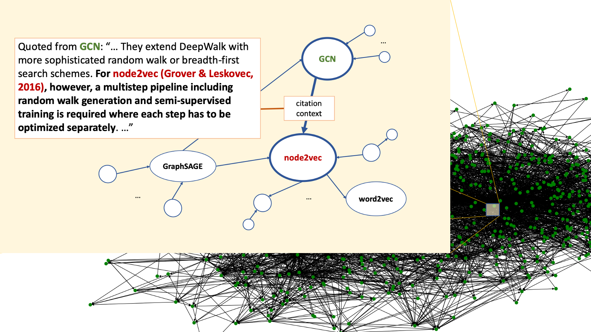

# CGCT Datasets
Main contributors: [Mengxia Yu](myu2@nd.edu), [Wenhao Yu](wyu1@nd.edu), and [Meng Jiang](mjiang2@nd.edu) ([DM2 Lab](http://www.meng-jiang.com/lab.html), University of Notre Dame)

## Motivation
Graph learning and text generation are two popular machine learning applications. Recent research shows that texts play an important role in graph data learning. For example, the widely studied citation graph dataset [CORA](https://github.com/tkipf/pygcn/tree/master/data/cora) uses paper abstract as node attribute, which improves the performance of node classification and link prediction. Also, graph structural information can enhance text generation. For example, knowledge graphs have been used to improve question answering (e.g., [KBQA](https://github.com/svakulenk0/KBQA)), dialog system, and summarization. However, very little research has been performed to explore the mutual enhancement between graph learning and text generation, specifically, between predicting links and generating textual attributes of links, due to lack of datasets that have textual description on the links. The texts on linkage can be considered as the explanation to link formation, which sheds insight on novel explanable link prediction approaches -- explaining link prediction with natural language.

We introduce a collection of **19** benchmarks for performing and evaluating text-based link prediction and graph-based text generation. These datasets are generated from [S2ORC](https://github.com/allenai/s2orc) of 81.1M papers which has citation graphs (i.e. rich paper metadata, abstracts, citation links) with a full text corpus. The data components are:
- **nodes:** papers;
- **links:** "PaperA-cites-PaperB" directed edges; there can be multiple edges between a pair of nodes;
- **node attribute:** abstract or full text of the paper node;
- **link attribute:** part of PaperA's text as context of citing PaperB, called "citation contextual text" on the link.

The principles of building the benchmarks are as follows:
- **Related to a central topic.** Each benchmark is expanded from a specific paper of a popular topic, such as [node2vec](https://dl.acm.org/doi/10.1145/2939672.2939754) or [gcn](https://arxiv.org/abs/1609.02907) in graph learning, [transformer](https://arxiv.org/abs/1706.03762) in language model, and [neuralcf](https://arxiv.org/abs/1708.05031) in recommender system.
- **Connectivity and completeness.** The citation graph in each benchmark is a connected component. Any two nodes are connected to each other by paths. In the benchmarks, the attribute of every paper node is text-rich, not only abstract but also full text. Every citation edge has textual attribute, i.e., citation contextual texts.
- **Good size for graph learning and text generation on a single GPU.** The number of nodes in the benchmarks is usually ranged between 1000 to 10000. The largest number is smaller than 20000 and the smallest is bigger than 500.

## Datasets

### Downloads
The **19** benchmark datasets are available [here](https://drive.google.com/drive/folders/1MPA93HmyHX_unV0vME91-6O4u1PkQf27?usp=sharing).

### Notation of Graph Statistics
- k: Number of hops expanded from the center node
- \|V\|: Number of nodes
- \|E\|: Number of links
- davg: Average degree
- wabst: Average number of words in abstract (node attribute)
- wbody: Average number of words in body text (node attribute)
- wcite: Average number of words in citation context (link attribute)

### Experimental Settings of Citation Link Prediction

**Validation setting**: Each dataset includes a training set, a validation set, and a test set. The test set contains 10% of observed citation links as positive examples and the same number of non-existent links as negative ones. The validation set contains 10% of the links from the training set (i.e., 9% of the entire dataset) as positive examples and the same number of non-existent links as negative examples.

**Evaluation methods**: Area Under the Curve (AUC) and Average Precision (AP).

**Algorithms**: We adopt the basic [Graph Convolutional Networks (GCN)](https://arxiv.org/abs/1609.02907) and [Text Graph Convolutional Networks (TextGCN)](https://arxiv.org/abs/1809.05679) as our baseline methods. We use a two-layer GCN encoder and a simple inner product decoder.

### Experimental Settings of Citation Contextual Text Generaion

**Validation setting**: Each dataset includes a training set, a validation set, and a test set. The test set contains citation contexts of xxx of observed citation links.

**Evaluation methods**: Recall-Oriented Understudy for Gisting Evaluation (ROUGE), BiLingual Evaluation Understudy (BLEU), and Metric for Evaluation of Translation with Explicit ORdering (METEOR)

**Algorithms**: We adopt the multi-document summarization architecture proposed by [(Liu, 2018)](https://arxiv.org/abs/1801.10198), which is capable to summarize multi-documents with long sequence, as baseline model. The model consists of two stage: extractive stage and abstractive stage. In extractive stage, we compute tf-idf to rank paragraphs of the cited and citing paper, where the query is the title of cited (and citing) paper. In abstractive stage, we derive the raw text input as the concatination of the paragraphs in order, and prefixed with the title. We tokenize and select the first L tokens to form the input sequences. We adopt Transformer Decoder with Memory-compressed Attention (T-DMCA) as decoder.

### Dataset 1: [node2vec](https://drive.google.com/file/d/12zfP1UhFEaVJysCpP8EqmfwJLLTNJ0Y_/view?usp=sharing). Topic: Graph learning.
Center paper: [node2vec: Scalable feature learning for networks](https://dl.acm.org/doi/10.1145/2939672.2939754) (ID: 29688)

| k | \|V\| | \|E\| | davg | wabst | wbody | wcite |
|---|-------|-------|-------|-----------|------------|------------|
|  3 |  6491    | 44477 | 6.85  |       159    |    5452        |       96     |

Performance on citation link prediction:
TODO: A table.

Performance on citation contextual text generation:
TODO: A table.

### Dataset 2-1: [GCN-small](https://github.com/dmsquare/CiteExplainer/tree/master/CGCT-GCN-small). Topic: Graph learning.

Center paper: [Semi-supervised classification with graph convolutional networks](https://arxiv.org/abs/1609.02907) (ID: 3144218)

| k | \|V\| | \|E\| | davg | wabst | wbody | wcite |
|---|-------|-------|-------|-----------|------------|------------|
|  2 |  862    |  6482  | 7.52  |       172    |    5777        |       94     |

Performance on citation link prediction:
TODO: A table.

Performance on citation contextual text generation:
TODO: A table.

### Dataset 2-2: [GCN](https://drive.google.com/file/d/1ZQiOn0aUdwB699e6yl5dEr__YXBrxbby/view?usp=sharing). Topic: Graph learning.

Center paper: [Semi-supervised classification with graph convolutional networks](https://arxiv.org/abs/1609.02907) (ID: 3144218)

| k | \|V\| | \|E\| | davg | wabst | wbody | wcite |
|---|-------|-------|-------|-----------|------------|------------|
| 3 |   16366  | 159353 |  9.74  |     164     |    5120       |     88      |

Performance on citation link prediction:
TODO: A table.

Performance on citation contextual text generation:
TODO: A table.

### Dataset 3: [node2vec + GCN](https://drive.google.com/file/d/1VNJUUlJhw-ndi5VfuTNNJw2zS4kAVGTf/view?usp=sharing). Topic: Graph learning.

Center paper:
[node2vec: Scalable feature learning for networks](https://dl.acm.org/doi/10.1145/2939672.2939754) (ID: 29688) and [Semi-supervised classification with graph convolutional networks](https://arxiv.org/abs/1609.02907) (ID: 3144218)

| k | \|V\| | \|E\| | davg | wabst | wbody | wcite |
|---|-------|-------|-------|-----------|------------|------------|
| 3  | 1152  |  8760   | 7.60  |     173      |    5801       |        94   |

Performance on citation link prediction:
TODO: A table.

Performance on citation contextual text generation:
TODO: A table.

### Dataset 4: [BiLSTM_CRF](https://drive.google.com/file/d/1Gv0pGj7OIFBkixNpkGoPet-DgjTCL8xa/view?usp=sharing). Topic: Named entity recognition.

Center paper: [Neural Architectures for Named Entity Recognition](https://arxiv.org/abs/1603.01360)(ID: 6042994)

| k | \|V\| | \|E\| | davg | wabst | wbody | wcite |
|---|-------|-------|-------|-----------|------------|------------|
|3  | 4803 |   40737  | 8.48 |      138   |    4559       |    97       |

Performance on citation link prediction:
TODO: A table.

Performance on citation contextual text generation:
TODO: A table.

### Dataset 5 [CNN_BiLSTM](https://drive.google.com/file/d/1ngVrxAmWyebsGC1jM0_anWV40SuwFVjZ/view?usp=sharing). Topic: Named entity recognition.

Center paper: [End-to-end Sequence Labeling via Bi-directional LSTM-CNNs-CRF](https://arxiv.org/abs/1603.01354)(ID: 10489017)

| k | \|V\| | \|E\| | davg | wabst | wbody | wcite |
|---|-------|-------|-------|-----------|------------|------------|
| 3 |   12481  | 96552 | 7.74  | 157  |      4984    |     90      |

Performance on citation link prediction:
TODO: A table.

Performance on citation contextual text generation:
TODO: A table.

### Dataset 6 [BiLSTM_CRF + CNN_BiLSTM](https://drive.google.com/file/d/1gFC_OWQ0yNTNakBlnujxgs8KAy-qpVqv/view?usp=sharing). Topic: Named entity recognition.

Center paper: 
[Neural Architectures for Named Entity Recognition](https://arxiv.org/abs/1603.01360)(ID: 6042994) and [End-to-end Sequence Labeling via Bi-directional LSTM-CNNs-CRF](https://arxiv.org/abs/1603.01354)(ID: 10489017)

| k | \|V\| | \|E\| | davg | wabst | wbody | wcite |
|---|-------|-------|-------|-----------|------------|------------|
| 2 |  5473   | 48169 |  8.80 |      137     |     4534      |      97     |

Performance on citation link prediction:
TODO: A table.

Performance on citation contextual text generation:
TODO: A table.

### Dataset 7 [SeqAttention](https://drive.google.com/file/d/1d4cUN8X6zl-eRwpORUFUyZ-qilPmH1Ue/view?usp=sharing). Topic: Text generation.

Center paper: [Neural Machine Translation by Jointly Learning to Align and Translate](https://arxiv.org/abs/1409.0473) (ID: 11212020)

| k | \|V\| | \|E\| | davg | wabst | wbody | wcite |
|---|-------|-------|-------|-----------|------------|------------|
| 3 |  3354   | 22850 | 6.81  |     146      |     4598      |      98     |

Performance on citation link prediction:
TODO: A table.

Performance on citation contextual text generation:
TODO: A table.

### Dataset 8 [CopyNet](https://drive.google.com/file/d/1I720Kspz6KkrsOOtrHXabHioaECyBzDZ/view?usp=sharing). Topic: Text generation.

Center paper: [Incorporating Copying Mechanism in Sequence-to-Sequence Learning](https://arxiv.org/abs/1603.06393) (ID: 8174613)

| k | \|V\| | \|E\| | davg | wabst | wbody | wcite |
|---|-------|-------|-------|-----------|------------|------------|
| 3 |   2651  | 27904 |  10.53 |      140     |      4826     |     98      |

Performance on citation link prediction:
TODO: A table.

Performance on citation contextual text generation:
TODO: A table.

### Dataset 9 [SeqAttention + CopyNet](https://drive.google.com/file/d/1zcdnyZrfSqPSN2IPrsVbd2Jo3gRdxZmO/view?usp=sharing). Topic: Text generation.

Center paper: [Neural Machine Translation by Jointly Learning to Align and Translate](https://arxiv.org/abs/1409.0473) (ID: 11212020) and [Incorporating Copying Mechanism in Sequence-to-Sequence Learning](https://arxiv.org/abs/1603.06393) (ID: 8174613)

| k | \|V\| | \|E\| | davg | wabst | wbody | wcite |
|---|-------|-------|-------|-----------|------------|------------|
| 2 |   3505  | 25050 | 7.15  |     146      |     4601      |      98     |

Performance on citation link prediction:
TODO: A table.

Performance on citation contextual text generation:
TODO: A table.

### Dataset 10 [Transformer](https://drive.google.com/file/d/1egSADe4CHG7G-Wp9NYYQqj402Ttzh9h7/view?usp=sharing). Topic: Language model.

Center paper: [Attention Is All You Need](http://papers.nips.cc/paper/7181-attention-is-all-you-need) (ID: 13756489)

| k | \|V\| | \|E\| | davg | wabst | wbody | wcite |
|---|-------|-------|-------|-----------|------------|------------|
| 3 |  1684   | 8725 |  5.18 |     149      |     4604      |     93      |

Performance on citation link prediction:
TODO: A table.

Performance on citation contextual text generation:
TODO: A table.

### Dataset 11 [CANLM](https://drive.google.com/file/d/1dDwScfp0Lig3aop3EnicDzClJ8fSL4aG/view?usp=sharing). Topic: Language model.

Center paper: [Character-Aware Neural Language Models](https://arxiv.org/abs/1508.06615) (ID: 686481)

| k | \|V\| | \|E\| | davg | wabst | wbody | wcite |
|---|-------|-------|-------|-----------|------------|------------|
| 3 |  6683   | 62812 | 9.40  |    146       |    4798       |     96      |

Performance on citation link prediction:
TODO: A table.

Performance on citation contextual text generation:
TODO: A table.

### Dataset 12 [Transformer + CANLM](https://drive.google.com/file/d/182fp8NKaFqznKw4AmitSANvD5NmaHOix/view?usp=sharing). Topic: Language model.

Center paper: [Attention Is All You Need](http://papers.nips.cc/paper/7181-attention-is-all-you-need) (ID: 13756489) and [Character-Aware Neural Language Models](https://arxiv.org/abs/1508.06615) (ID: 686481)

| k | \|V\| | \|E\| | davg | wabst | wbody | wcite |
|---|-------|-------|-------|-----------|------------|------------|
| 2 |   2039  | 11020 | 9.98  |     146      |     4535      |    94       |

Performance on citation link prediction:
TODO: A table.

Performance on citation contextual text generation:
TODO: A table.

### Dataset 13 [GAN](https://drive.google.com/file/d/1qMCgQoRNjdO3l-UiwaGhpmO34iIhr0xO/view?usp=sharing). Topic: Generative model.

Center paper: [Generative Adversarial Nets](http://papers.nips.cc/paper/5423-generative-adversarial-nets) (ID: 12209503)

| k | \|V\| | \|E\| | davg | wabst | wbody | wcite |
|---|-------|-------|-------|-----------|------------|------------|
| 3 |   10586  | 102380 | 9.67  |     170    |  5473  |     90   |

Performance on citation link prediction:
TODO: A table.

Performance on citation contextual text generation:
TODO: A table.

### Dataset 14 [VAE](https://drive.google.com/file/d/1hchidClLUVVvgWYRfuiNgzKd84YOBcjM/view?usp=sharing). Topic: Generative model.

Center paper: [Auto-Encoding Variational Bayes](https://arxiv.org/abs/1312.6114) (ID: 15789289)

| k | \|V\| | \|E\| | davg | wabst | wbody | wcite |
|---|-------|-------|-------|-----------|------------|------------|
| 3 |    2292 | 15267  |       13.38    |       160    |     5741  |  97 |

Performance on citation link prediction:
TODO: A table.

Performance on citation contextual text generation:
TODO: A table.

### Dataset 15 [GAN + VAE](https://drive.google.com/file/d/1GgGfb8FPNBYHdl5PTfh1p8PV5G_RXORC/view?usp=sharing). Topic: Generative model.

Center paper: [Generative Adversarial Nets](http://papers.nips.cc/paper/5423-generative-adversarial-nets) (ID: 12209503) and [Auto-Encoding Variational Bayes](https://arxiv.org/abs/1312.6114) (ID: 15789289)

| k | \|V\| | \|E\| | davg | wabst | wbody | wcite |
|---|-------|-------|-------|-----------|------------|------------|
| 2 |   2440  | 16399 | 13.40 |  160    |   5712     |  97        |

Performance on citation link prediction:
TODO: A table.

Performance on citation contextual text generation:
TODO: A table.

### Dataset 16 [NeuralCF](https://drive.google.com/file/d/1mwyOgh2Fp-owm5HdJTsPBJMqGtoEVS03/view?usp=sharing). Topic: Deep RecSys.

Center paper: [Neural Collaborative Filtering](https://dl.acm.org/doi/abs/10.1145/3038912.3052569)(ID: 13907106)

| k | \|V\| | \|E\| | davg | wabst | wbody | wcite |
|---|-------|-------|-------|-----------|------------|------------|
| 3 |   17554  | 150737 |  8.59 |    167       |       5123    |       87    |

Performance on citation link prediction:
TODO: A table.

Performance on citation contextual text generation:
TODO: A table.

### Dataset 17 [GCMC](https://drive.google.com/file/d/1M26aD2Si_fTVmG__OgdyoqwvBqODqKKl/view?usp=sharing). Topic: Deep RecSys.

Center paper: [Graph Convolutional Matrix Completion](https://arxiv.org/abs/1706.02263) (ID: 36809545)

| k | \|V\| | \|E\| | davg | wabst | wbody | wcite |
|---|-------|-------|-------|-----------|------------|------------|
| 3 |  4338   | 31991 | 7.37  |      151     |      4905     |      97  |

Performance on citation link prediction:
TODO: A table.

Performance on citation contextual text generation:
TODO: A table.

### Dataset 18 [NeuralCF + GCMC](https://drive.google.com/file/d/10_cyNo7l39Dkk1auZNOzNwkZz1Ef-AOR/view?usp=sharing). Topic: Deep RecSys.

Center paper: [Neural Collaborative Filtering](https://dl.acm.org/doi/abs/10.1145/3038912.3052569) (ID: 13907106) and [Graph Convolutional Matrix Completion](https://arxiv.org/abs/1706.02263) (ID: 36809545)

| k | \|V\| | \|E\| | davg | wabst | wbody | wcite |
|---|-------|-------|-------|-----------|------------|------------|
| 2 |   18045  | 157990 | 8.76  |    167       |     5152      |      87     |

Performance on citation link prediction:
TODO: A table.

Performance on citation contextual text generation:
TODO: A table.
