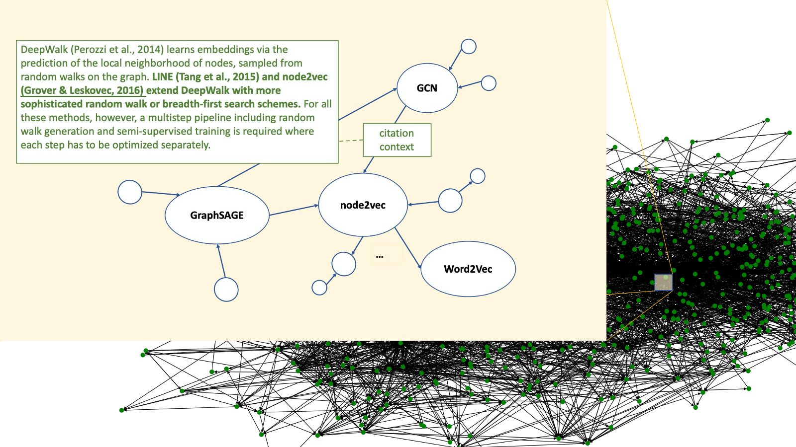

# CGCT Datasets
Main contributors: [Mengxia Yu](myu2@nd.edu), [Wenhao Yu](wyu1@nd.edu), and [Meng Jiang](mjiang2@nd.edu) ([DM2 Lab](http://www.meng-jiang.com/lab.html), University of Notre Dame)

## Motivation
Graph learning and text generation are two popular machine learning applications. Recent research shows that texts play an important role in graph data learning. For example, the widely studied citation graph dataset [CORA](https://github.com/tkipf/pygcn/tree/master/data/cora) uses paper abstract as node attribute, which improves the performance of node classification and link prediction. Also, graph structural information can enhance text generation. For example, knowledge graphs have been used to improve question answering (e.g., [KBQA](https://github.com/svakulenk0/KBQA)), dialog system, and summarization. However, very little research has been performed to explore the mutual enhancement between graph learning and text generation, specifically, between predicting links and generating textual attributes of links, due to lack of datasets that have textual description on the links. The texts on linkage can be considered as the explanation to link formation, which sheds insight on novel explanable link prediction approaches -- explaining link prediction with natural language.

We introduce a collection of 19 benchmarks for performing and evaluating text-based link prediction and graph-based text generation. These datasets are generated from [S2ORC](https://github.com/allenai/s2orc) of 81.1M papers which has citation graphs (i.e. rich paper metadata, abstracts, citation links) with a full text corpus. The data components are:
- **nodes:** papers;
- **links:** "PaperA-cites-PaperB" directed edges;
- **node attribute:** abstract or full text of the paper node;
- **link attribute:** part of PaperA's text as context of citing PaperB, called "citation contextual text" on the link.

The principles of building the benchmarks are as follows:
- **Related to a central topic.** Each benchmark is expanded from a specific paper of a popular topic, such as [node2vec](https://dl.acm.org/doi/10.1145/2939672.2939754) or [gcn](https://arxiv.org/abs/1609.02907) in graph learning, [transformer](https://arxiv.org/abs/1706.03762) in language model, and [neuralcf](https://arxiv.org/abs/1708.05031) in recommender system.
- **Connectivity and completeness.** The citation graph in each benchmark is a connected component. Any two nodes are connected to each other by paths. In the benchmarks, the attribute of every paper node is text-rich, not only abstract but also full text. Every citation edge has textual attribute, i.e., citation contextual texts.
- **Good size for graph learning and text generation on a single GPU.** The number of nodes in the benchmarks is usually ranged between 1000 to 10000. The largest number is smaller than 20000 and the smallest is bigger than 500.

## Dataset Statistics
The datasets are available [here](https://drive.google.com/drive/folders/1MPA93HmyHX_unV0vME91-6O4u1PkQf27?usp=sharing).

### Summary of Network Statistics Notation
- center_id: ID of the center paper of the k-hop graph
- \|V\|: Number of  nodes
- \|E\|: Number of edges
- d_avg: Average degree (unweighted)
- d_min: Minimum degree
- k: k of k-hop
- w_abs_avg: average number of words in abstract
- w_boey_avg: average number of words in body text
- w_cnxt_avg: average number of words in citation context

### Dataset 1: node2vec. Community: Graph learning. Center: node2vec.
Center paper title: “node2vec: Scalable feature learning for networks”

| center_id | \|V\| | \|E\| | d_avg | d_min | k | w_abs_avg | w_body_avg | w_cnxt_avg |
|------------|-------|-------|-------|-------|---|-----------|------------|------------|
| 29688     |  6491    | 44477 | 6.85  |  3     |  3 |       159    |    5452        |       96     |

### Dataset 2: [gcn-small](https://github.com/dmsquare/CiteExplainer/tree/master/CGCT-GCN-small). Community: Graph learning. Center: gcn.

Center paper title: “Semi-supervised classification with graph convolutional networks”

| center_id | \|V\| | \|E\| | d_avg | d_min | k | w_abs_avg | w_body_avg | w_cnxt_avg |
|------------|-------|-------|-------|-------|---|-----------|------------|------------|
| 3144218  |  862    |  6482  | 7.52  |  2     |  2 |       172    |    5777        |       94     |

### Dataset 

